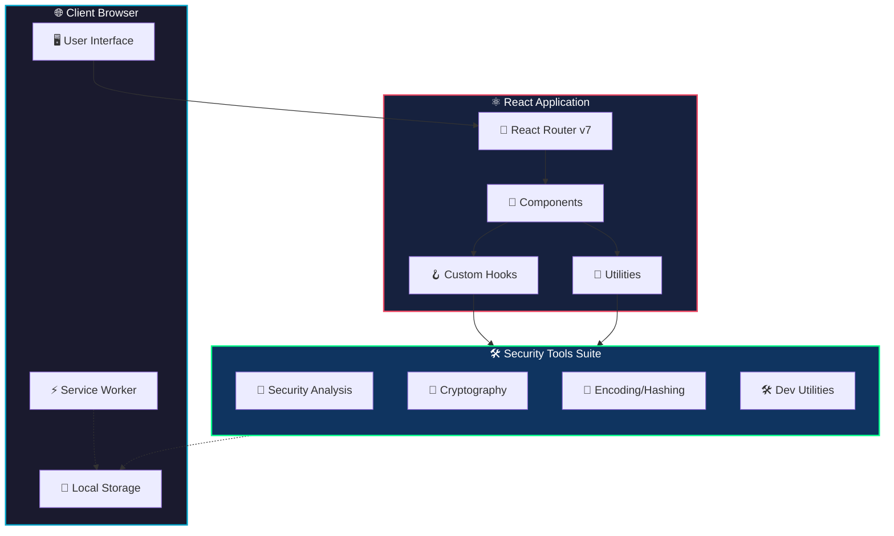
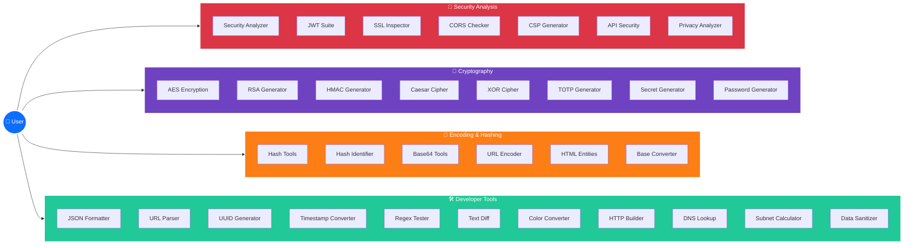
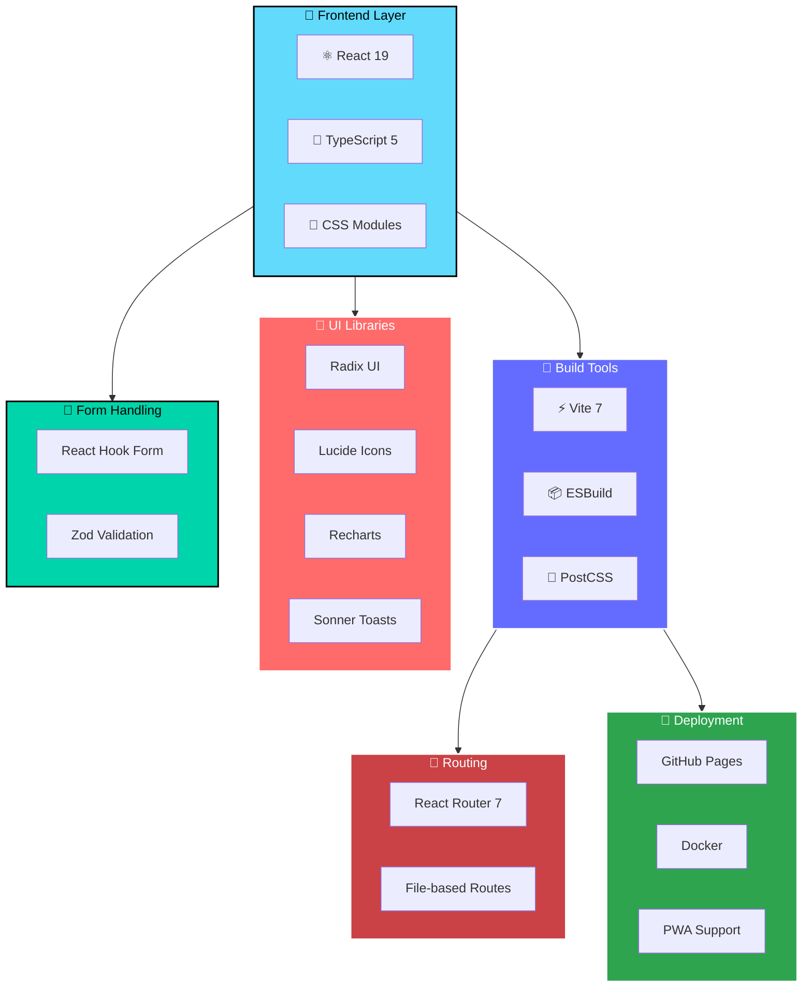
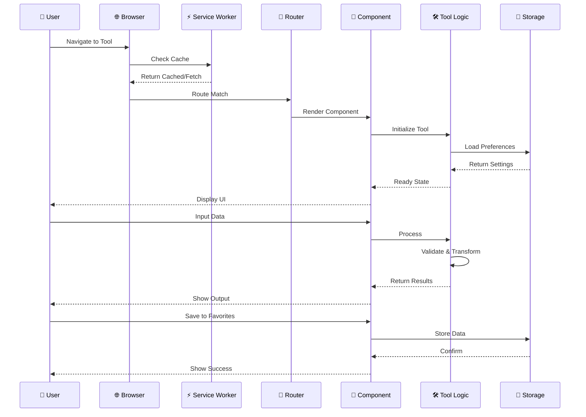
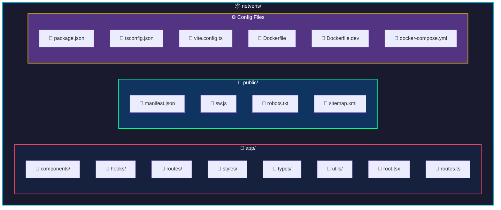

<p align="center">
  
</p>

<h1 align="center">🛡️ Netveris</h1>

<p align="center">
  <strong>Professional Security Analysis & Developer Tools Suite</strong>
</p>

<p align="center">
  <a href="https://netveris.github.io"></a>
  <a href="#-quick-start"></a>
  <a href="#-docker"></a>
</p>

<p align="center">
  
  
  
  
  
</p>

<p align="center">
  
  
  
  
</p>

---

## 📖 About

**Netveris** is a comprehensive suite of **40+ security analysis and developer tools** built with modern web technologies. Designed for security professionals, developers, and enthusiasts who need quick access to essential security utilities without leaving their browser.

<p align="center">
  
  
  
</p>

---

## ✨ Features

### 🔐 **Security Analysis Tools**

| Tool                       | Description                                                                  |
| -------------------------- | ---------------------------------------------------------------------------- |
| 🛡️ **Security Analyzer**   | Comprehensive analysis of HTTP headers, cookies, and security configurations |
| 🔑 **JWT Analyzer**        | Decode, validate, and inspect JSON Web Tokens                                |
| 🔏 **JWT Generator**       | Create custom JWTs with various algorithms                                   |
| 🐛 **JWT Debugger**        | Debug and troubleshoot JWT issues                                            |
| 📋 **JWT Best Practices**  | Learn security best practices for JWT implementation                         |
| 🔒 **Password Checker**    | Analyze password strength with detailed feedback                             |
| 📜 **Certificate Decoder** | Parse and analyze SSL/TLS certificates                                       |
| 🌐 **CORS Checker**        | Test and validate CORS configurations                                        |
| 🛡️ **CSP Generator**       | Generate Content Security Policy headers                                     |
| 🔍 **Privacy Analyzer**    | Analyze privacy implications of web applications                             |
| 🔐 **API Security**        | Test and validate API security configurations                                |
| 🔒 **SSL Inspector**       | Inspect SSL/TLS configurations                                               |

### 🔢 **Encoding & Hashing**

| Tool                   | Description                                  |
| ---------------------- | -------------------------------------------- |
| #️⃣ **Hash Tools**      | Generate MD5, SHA-1, SHA-256, SHA-512 hashes |
| 🔍 **Hash Identifier** | Identify hash types automatically            |
| 🔐 **HMAC Generator**  | Create HMAC signatures                       |
| 📝 **Base64 Tools**    | Encode and decode Base64 strings             |
| 🔗 **URL Encoder**     | URL encoding and decoding                    |
| 📄 **HTML Entities**   | Encode/decode HTML entities                  |
| 🔢 **Base Converter**  | Convert between binary, octal, decimal, hex  |

### 🔑 **Encryption & Cryptography**

| Tool                      | Description                            |
| ------------------------- | -------------------------------------- |
| 🔐 **AES Encryption**     | Encrypt and decrypt with AES algorithm |
| 🔑 **RSA Generator**      | Generate RSA key pairs                 |
| 🎯 **Caesar Cipher**      | Classic encryption cipher              |
| ⊕ **XOR Cipher**          | XOR encryption/decryption              |
| 🔢 **TOTP Generator**     | Generate Time-based One-Time Passwords |
| 🎲 **Secret Generator**   | Generate secure random secrets         |
| 🔑 **Password Generator** | Create strong, random passwords        |

### 🛠️ **Developer Utilities**

| Tool                       | Description                       |
| -------------------------- | --------------------------------- |
| 📝 **JSON Formatter**      | Format and validate JSON data     |
| 🔗 **URL Parser**          | Parse and analyze URLs            |
| 🆔 **UUID Generator**      | Generate various UUID versions    |
| ⏰ **Timestamp Converter** | Convert between timestamp formats |
| 🔤 **Regex Tester**        | Test regular expressions          |
| 📊 **Text Diff**           | Compare text and find differences |
| 🎨 **Color Converter**     | Convert between color formats     |
| 🌐 **HTTP Builder**        | Build and test HTTP requests      |
| 🧹 **Data Sanitizer**      | Sanitize and clean data           |
| 🌐 **DNS Lookup**          | Perform DNS queries               |
| 📡 **Subnet Calculator**   | Calculate network subnets         |

---

## 🚀 Quick Start

### Prerequisites

- **Node.js** 20.x or higher
- **npm** 9.x or higher (or pnpm/yarn)

### Installation

```bash
# Clone the repository
git clone https://github.com/netveris/netveris.github.io.git

# Navigate to project directory
cd netveris.github.io

# Install dependencies
npm install

# Start development server
npm run dev
```

Your application will be available at `http://localhost:5173` 🎉

---

## 🐳 Docker

Run Netveris instantly with Docker - no setup required!

### Quick Run (Production)

```bash
# Build and run with Docker Compose
docker-compose up -d

# Access at http://localhost:3000
```

### Development Mode

```bash
# Run with hot reload
docker-compose --profile dev up netveris-dev

# Access at http://localhost:5173
```

### Manual Docker Build

```bash
# Build the image
docker build -t netveris .

# Run the container
docker run -d -p 3000:3000 --name netveris-app netveris
```

---

## 📦 Building for Production

```bash
# Create production build
npm run build

# The build output will be in:
# - build/client/  → Static assets
# - build/server/  → Server-side code (if SSR enabled)
```

---

## 🌐 Deployment

### GitHub Pages (Automatic)

This repository is configured for **automatic deployment** to GitHub Pages:

1. Push to `main` branch
2. GitHub Actions builds and deploys automatically
3. Access at: **https://netveris.github.io**

### Self-Hosting

You can also deploy Netveris on your own infrastructure:

```bash
# Using Docker
docker-compose up -d

# Or build manually
npm run build
npm run start
```

---

## 🏗️ System Architecture

### High-Level Overview



### Tool Categories Architecture



### Component Architecture

```mermaid
flowchart TB
    subgraph Root["📦 App Root"]
        RootTSX["root.tsx"]
    end

    subgraph Layout["🎨 Layout Layer"]
        Nav["Navigation"]
        Theme["Theme Toggle"]
        Toast["Toast System"]
    end

    subgraph Pages["📄 Route Pages"]
        Home["🏠 Home"]
        Dashboard["📊 Dashboard"]
        Favorites["⭐ Favorites"]
        Recent["🕐 Recent"]
        Docs["📚 Documentation"]
        ToolPages["🛠️ 40+ Tool Pages"]
    end

    subgraph SharedUI["🧩 Shared Components"]
        ToolHeader["Tool Header"]
        CodeWindow["Code Window"]
        CodeBlock["Code Block"]
        AnalysisPanel["Analysis Panel"]
        IssueCard["Issue Card"]
        RiskBadge["Risk Badge"]
        SecurityScore["Security Score"]
        ExportMenu["Export Menu"]
        KeyboardShortcuts["Keyboard Shortcuts"]
    end

    subgraph UIKit["🎯 UI Primitives"]
        Button["Button"]
        Input["Input"]
        Select["Select"]
        Dialog["Dialog"]
        Tabs["Tabs"]
        Card["Card"]
        Badge["Badge"]
        Tooltip["Tooltip"]
    end

    RootTSX --> Layout
    Layout --> Pages
    Pages --> SharedUI
    SharedUI --> UIKit

    style Root fill:#e91e63,stroke:#fff,stroke-width:2px,color:#fff
    style Layout fill:#9c27b0,stroke:#fff,stroke-width:2px,color:#fff
    style Pages fill:#673ab7,stroke:#fff,stroke-width:2px,color:#fff
    style SharedUI fill:#3f51b5,stroke:#fff,stroke-width:2px,color:#fff
    style UIKit fill:#2196f3,stroke:#fff,stroke-width:2px,color:#fff
```



### Data Flow Architecture

```mermaid
flowchart LR
    subgraph Input["📥 User Input"]
        Text["Text Input"]
        File["File Upload"]
        Paste["Clipboard Paste"]
    end

    subgraph Processing["⚙️ Processing Layer"]
        Validate["✅ Validation"]
        Transform["🔄 Transform"]
        Analyze["🔍 Analysis"]
    end

    subgraph Output["📤 Output"]
        Display["🖥️ Display Results"]
        Copy["📋 Copy to Clipboard"]
        Export["💾 Export File"]
        Share["🔗 Share Link"]
    end

    subgraph Storage["💾 Persistence"]
        LocalStorage["Local Storage"]
        Favorites["Favorites"]
        History["Recent History"]
        Settings["User Settings"]
    end

    Input --> Processing
    Processing --> Output
    Processing -.-> Storage
    Storage -.-> Input

    style Input fill:#4caf50,stroke:#fff,stroke-width:2px,color:#fff
    style Processing fill:#ff9800,stroke:#fff,stroke-width:2px,color:#fff
    style Output fill:#2196f3,stroke:#fff,stroke-width:2px,color:#fff
    style Storage fill:#9c27b0,stroke:#fff,stroke-width:2px,color:#fff
```



### Technology Stack



### Request Flow Sequence



---

## 🛠️ Tech Stack

<table>
  <tr>
    <td align="center" width="100">
      
      <br><strong>React 19</strong>
    </td>
    <td align="center" width="100">
      
      <br><strong>TypeScript</strong>
    </td>
    <td align="center" width="100">
      
      <br><strong>Vite 7</strong>
    </td>
    <td align="center" width="100">
      
      <br><strong>React Router</strong>
    </td>
    <td align="center" width="100">
      
      <br><strong>CSS Modules</strong>
    </td>
  </tr>
</table>

**Additional Libraries:**

- 🎨 **Radix UI** - Accessible component primitives
- 📊 **Recharts** - Data visualization
- 🎭 **Lucide Icons** - Beautiful icons
- 🔔 **Sonner** - Toast notifications
- 📝 **React Hook Form** - Form management
- ✅ **Zod** - Schema validation

---

## 📁 Project Structure



```
netveris/
├── 📁 app/
│   ├── 📁 components/     # Reusable UI components
│   │   └── 📁 ui/         # Base UI primitives
│   ├── 📁 hooks/          # Custom React hooks
│   ├── 📁 routes/         # Page components
│   ├── 📁 styles/         # Global styles & tokens
│   ├── 📁 types/          # TypeScript definitions
│   ├── 📁 utils/          # Utility functions
│   ├── 📄 root.tsx        # App root component
│   └── 📄 routes.ts       # Route definitions
├── 📁 public/             # Static assets
├── 📄 Dockerfile          # Production Docker config
├── 📄 Dockerfile.dev      # Development Docker config
├── 📄 docker-compose.yml  # Docker Compose config
├── 📄 package.json        # Dependencies & scripts
├── 📄 tsconfig.json       # TypeScript config
├── 📄 vite.config.ts      # Vite config
└── 📄 README.md           # You are here! 👋
```

---

## ⌨️ Keyboard Shortcuts

| Shortcut                       | Action                  |
| ------------------------------ | ----------------------- |
| <kbd>Ctrl</kbd> + <kbd>K</kbd> | Open command palette    |
| <kbd>Ctrl</kbd> + <kbd>/</kbd> | Show keyboard shortcuts |
| <kbd>Ctrl</kbd> + <kbd>D</kbd> | Toggle dark mode        |
| <kbd>Esc</kbd>                 | Close dialogs           |

---

## 🤝 Contributing

Contributions are welcome! Here's how you can help:

1. **🍴 Fork** the repository
2. **🌿 Create** a feature branch: `git checkout -b feature/amazing-feature`
3. **💾 Commit** changes: `git commit -m 'Add amazing feature'`
4. **📤 Push** to branch: `git push origin feature/amazing-feature`
5. **🔃 Open** a Pull Request

### Development Guidelines

- Follow TypeScript best practices
- Use CSS Modules for styling
- Write meaningful commit messages
- Test your changes thoroughly

---

## 📜 License

This project is licensed under the **MIT License** - see the [LICENSE](LICENSE) file for details.

---

## 🙏 Acknowledgments

- [React](https://react.dev) - UI Library
- [Vite](https://vitejs.dev) - Build Tool
- [Radix UI](https://www.radix-ui.com) - UI Primitives
- [Lucide](https://lucide.dev) - Icons
- [Open Props](https://open-props.style) - CSS Variables

---

<p align="center">
  <strong>Made with ❤️ by the Netveris Team</strong>
</p>

<p align="center">
  <a href="https://github.com/netveris">
    
  </a>
</p>

<p align="center">
  <sub>⭐ Star this repo if you find it useful!</sub>
</p>
